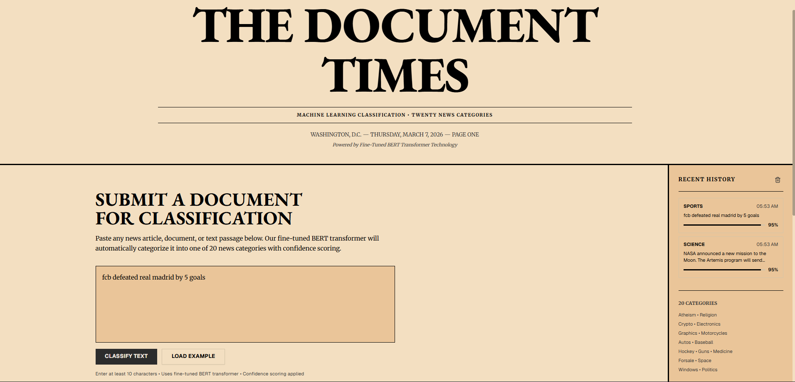
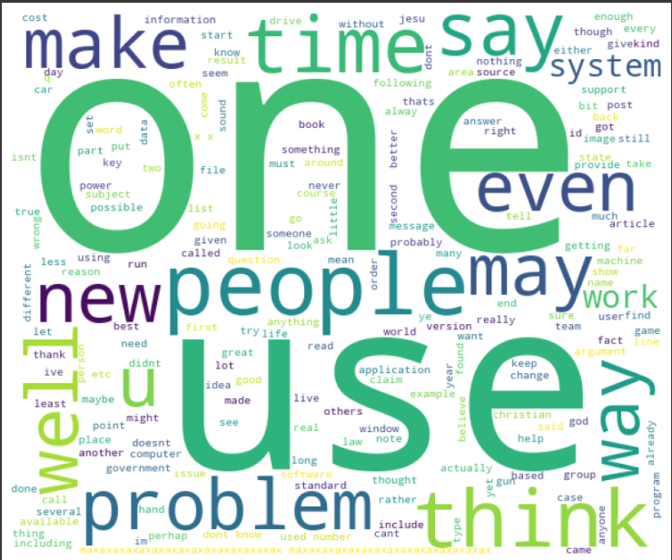

# Document Categorization

<div align="center">

[](https://python.org)
[](https://pytorch.org)
[](https://huggingface.co)
[](https://fastapi.tiangolo.com)
[](https://nextjs.org)
[](https://vercel.com)

<br/>

> An end-to-end NLP document classification system. From classical ML baselines to a fine-tuned BERT transformer, deployed as a production web application with a REST API.

<br/>

[Live Web App](https://bert-news-classification.vercel.app/) &nbsp;&nbsp;|&nbsp;&nbsp; [HuggingFace Model](https://huggingface.co/murtazamajid/bert-newsgroups-8class) &nbsp;&nbsp;|&nbsp;&nbsp; [API Documentation](https://murtazamajid-bert-document-classifier.hf.space/docs)

</div>

---


<br/>

---

<br/>

## Table of Contents

- [Project Overview](#project-overview)
- [Final Results](#final-results)
- [The Story](#the-story)
  - [Phase 1: Understanding the Data](#phase-1-understanding-the-data)
  - [Phase 2: Classical ML Baselines](#phase-2-classical-ml-baselines)
  - [Phase 3: BERT on 20 Categories](#phase-3-bert-on-20-categories)
  - [Phase 4: Rethinking the Labels](#phase-4-rethinking-the-labels)
  - [Phase 5: BERT on 7 Consolidated Categories](#phase-5-bert-on-7-consolidated-categories)
- [Web Application](#web-application)
- [API Reference](#api-reference)
- [Repository Structure](#repository-structure)
- [Local Setup](#local-setup)
- [Key Takeaways](#key-takeaways)

<br/>

---

<br/>

## Project Overview

This project builds a text classification system on the **20 Newsgroups** dataset, a benchmark of ~18,800 news documents across 20 categories. The goal was to classify any document into its correct topic, but more importantly, to treat the problem as a real engineering challenge rather than a notebook exercise.

The project progressed through distinct phases: exploring and understanding the data, establishing classical ML baselines, fine-tuning BERT, diagnosing why performance plateaued, redesigning the label schema, and finally shipping a full-stack production application.

**Dataset:** 18,846 documents across 20 newsgroup categories  
**Final Model:** Fine-tuned `bert-base-uncased` on 7 consolidated categories  
**Final Accuracy:** 86.8% test accuracy, 0.863 macro F1  
**Deployment:** FastAPI backend on HuggingFace Spaces + Next.js frontend on Vercel

<br/>

---

<br/>

## Final Results

| Model | Accuracy | Macro F1 | Notes |
|-------|----------|----------|-------|
| Random Forest (200 trees) | 68.1% | 0.650 | Worst classical model |
| Multinomial Naive Bayes | 73.4% | 0.710 | Fast TF-IDF baseline |
| Logistic Regression | 79.2% | 0.780 | Best classical model |
| BERT fine-tuned (20 classes) | 72.1% | 0.700 | Hit a label-quality ceiling |
| **BERT fine-tuned (7 classes)** | **86.8%** | **0.863** | **Production model** |

The 7-class BERT model outperforms the best classical model by **7.6 percentage points** and the 20-class BERT by **14.7 percentage points**. The improvement came entirely from rethinking the problem, not from adding model complexity.

<br/>

---

<br/>

## The Story

### Phase 1: Understanding the Data

Before writing a single line of model code, the dataset was explored to understand what we were working with. The 20 Newsgroups dataset contains 18,846 documents spread across 20 categories, but the distribution is not perfectly balanced.

**Category distribution across the 20 original classes:**


The distribution plot immediately reveals something important. Categories like `rec.sport.hockey`, `soc.religion.christian`, and `rec.motorcycles` each have close to 1,000 documents. But `talk.religion.misc` and `talk.politics.misc` sit at 628 and 775 respectively -- significantly fewer than the rest. This imbalance means any model trained on these labels will naturally struggle more on the underrepresented classes, compounding the difficulty of already hard-to-separate categories.

**Most frequent words across the entire corpus:**



The wordcloud shows the most frequent terms after basic preprocessing. Dominant words like "one", "use", "people", "time", "make", and "think" are generic enough to appear across almost every category. This tells us that simple word frequency alone will not be enough to discriminate between topics -- the model needs to understand context, not just vocabulary. This is precisely why bag-of-words models have an inherent ceiling on this dataset, and why a contextual model like BERT is the right direction.

<br/>

### Phase 2: Classical ML Baselines

The natural starting point was traditional machine learning. Each document was preprocessed with standard NLP steps: tokenisation, stopword removal, and lemmatisation using NLTK and spaCy. The cleaned text was then converted to TF-IDF vectors with 5,000 features and fed into three classifiers.

**Multinomial Naive Bayes** delivered 73.4% accuracy. It is fast and handles sparse TF-IDF vectors well, but its core assumption -- that every word feature is independent -- is rarely true in natural language.

**Logistic Regression** was the strongest classical model at 79.2% accuracy. It generalises well across high-dimensional sparse feature spaces and its coefficients are directly interpretable, making it easy to understand which terms drive each classification decision.

**Random Forest** with 200 estimators performed worst at 68.1%. Ensemble tree methods tend to struggle when the input space is very high-dimensional and sparse, which is exactly what TF-IDF produces.

| Model | Accuracy | Macro F1 |
|-------|----------|----------|
| Random Forest (200 trees) | 68.1% | 0.650 |
| Multinomial Naive Bayes | 73.4% | 0.710 |
| Logistic Regression | 79.2% | 0.780 |

```
Random Forest     ||||||||||||||||||||||||||||             68.1%
Naive Bayes       |||||||||||||||||||||||||||||            73.4%
Logistic Reg.     ||||||||||||||||||||||||||||||||         79.2%
```

The 79.2% from Logistic Regression was a useful benchmark, but the wordcloud had already told us why it would plateau here. When the most frequent words across the entire corpus are generic terms like "one", "use", and "people", a bag-of-words representation that counts word frequencies will consistently confuse categories that share the same common vocabulary. Understanding meaning requires understanding context, and context is exactly what TF-IDF cannot capture.

<br/>

### Phase 3: BERT on 20 Categories

The next step was fine-tuning `bert-base-uncased`, a transformer pretrained on large-scale English text. BERT reads full sentences, uses attention to understand word relationships, and captures contextual meaning in a way TF-IDF fundamentally cannot.

#### The Preprocessing Mistake

Before tokenising, the original pipeline applied the same preprocessing used for classical models: lowercasing, punctuation removal, stopword removal, and lemmatisation. This was exactly the wrong thing to do for BERT.

BERT was pretrained on natural English text as it actually appears. Its WordPiece tokeniser handles punctuation and morphological variation internally. Stopwords like "not", "but", and "however" carry real semantic weight that BERT uses to understand negation and contrast. Lemmatisation distorts the subword patterns that WordPiece relies on. Every preprocessing step that helps a TF-IDF model actively hurts a transformer.

```python
# Wrong approach for BERT -- the same pipeline used for TF-IDF
def clean_text_tfidf_style(text):
    text = text.lower()
    text = re.sub(r'[^a-z\s]', '', text)
    tokens = [t for t in text.split() if t not in stop_words]
    tokens = [lemmatizer.lemmatize(t) for t in tokens]
    return " ".join(tokens)

# Correct approach for BERT -- almost nothing
def clean_text(text: str) -> str:
    text = re.sub(r"[^\x00-\x7F]+", " ", text)  # remove non-ASCII noise only
    return re.sub(r"\s+", " ", text).strip()      # normalise whitespace only
```

#### Training Configuration

Several practices matter for stable BERT fine-tuning:

```python
CFG = {
    "model_name":   "bert-base-uncased",
    "max_length":   256,       # sweet spot between 512 (slow) and 128 (lossy)
    "batch_size":   16,
    "lr":           1e-5,      # lower LR prevents early destruction of pretrained weights
    "warmup_ratio": 0.2,       # 20% of steps for linear LR warmup
    "weight_decay": 0.01,
    "dropout":      0.3,
    "patience":     2,         # early stopping on validation loss
}
```

Weight decay also needs to be applied correctly. Applying it to LayerNorm weights and bias terms degrades performance. The standard practice is to exclude them:

```python
no_decay = ["bias", "LayerNorm.weight"]
optimizer_grouped_params = [
    {
        "params": [p for n, p in model.named_parameters()
                   if not any(nd in n for nd in no_decay)],
        "weight_decay": 0.01,
    },
    {
        "params": [p for n, p in model.named_parameters()
                   if any(nd in n for nd in no_decay)],
        "weight_decay": 0.0,
    },
]
optimizer = AdamW(optimizer_grouped_params, lr=CFG["lr"], eps=1e-8)
```

#### Training Curve

| Epoch | Train Loss | Val Loss | Val Accuracy |
|-------|-----------|----------|-------------|
| 1 | 2.61 | 1.64 | 54.9% |
| 2 | 1.39 | 1.12 | 67.1% |
| 3 | 1.08 | 0.99 | 70.1% |
| 4 | 0.95 | 0.95 | 71.6% |
| 5 | 0.88 | 0.95 | 71.8% |
| 6 | 0.86 | 0.95 | 71.8% |
| 7 | 0.86 | 0.95 | 71.8% -- early stop |

**Final test accuracy: 72.1%**

The model stalled. Training longer triggered overfitting. Higher dropout, lower learning rate, freezing bottom layers -- nothing meaningfully pushed accuracy past 72%. BERT was performing worse than Logistic Regression on this problem, which was a strong signal that something more fundamental was wrong.

#### The Confusion Matrix Revealed Everything

A detailed look at misclassifications showed the same patterns repeating:

```
True label: talk.religion.misc      Predicted: alt.atheism              -- 20 misclassifications
True label: talk.religion.misc      Predicted: soc.religion.christian   -- 21 misclassifications
True label: comp.sys.mac.hardware   Predicted: comp.sys.ibm.pc.hardware -- 21 misclassifications
```

These were not model failures. These were label design failures.

`talk.religion.misc`, `alt.atheism`, and `soc.religion.christian` are three different newsgroup forums that all discuss religion. A post asking whether God exists could plausibly belong to any of them. A post criticising organised religion could be `alt.atheism` or `talk.religion.misc`. The overlap is intrinsic to what these categories represent, not a statistical artifact.

The same problem exists for the hardware categories. `comp.sys.mac.hardware` and `comp.sys.ibm.pc.hardware` both contain posts about RAM, hard drives, graphics cards, drivers, and system crashes. The only thing separating them was which forum the original poster chose to use, not any meaningful semantic difference in the document content.

No model, however powerful, can reliably separate classes that humans themselves would struggle to separate. The problem was not the training. The problem was the categories.

<br/>

### Phase 4: Rethinking the Labels

Rather than continuing to tune against poorly defined labels, the categories were redesigned. The question was simple: which of these 20 categories are semantically distinct, and which are just subcategories of the same broader topic?

The answer was clear once framed that way. Mac hardware and IBM PC hardware are both computers. Baseball and hockey are both sports. Atheism and Christian discussion forums are both about religion. Merging them does not throw away information -- it removes artificial distinctions that were never grounded in semantic difference.

```python
label_consolidation = {
    # All three religion forums become one category
    "alt.atheism":               "religion",
    "soc.religion.christian":    "religion",
    "talk.religion.misc":        "religion",

    # All five computer forums become one category
    "comp.graphics":             "computers",
    "comp.os.ms-windows.misc":   "computers",
    "comp.sys.ibm.pc.hardware":  "computers",
    "comp.sys.mac.hardware":     "computers",
    "comp.windows.x":            "computers",

    # Sports separated from vehicles
    "rec.sport.baseball":        "sports",
    "rec.sport.hockey":          "sports",

    # Vehicles as their own category
    "rec.autos":                 "vehicles",
    "rec.motorcycles":           "vehicles",

    # All four science forums become one category
    "sci.crypt":                 "science",
    "sci.electronics":           "science",
    "sci.med":                   "science",
    "sci.space":                 "science",

    # All three politics forums become one category
    "talk.politics.guns":        "politics",
    "talk.politics.mideast":     "politics",
    "talk.politics.misc":        "politics",

    # Standalone
    "misc.forsale":              "marketplace and business",
}
```

20 fine-grained categories collapsed into 7 semantically clean ones. BERT was then retrained from scratch on these new labels.

<br/>

### Phase 5: BERT on 7 Consolidated Categories

The results were immediate and dramatic.

#### Per-Class Results

| Class | Precision | Recall | F1-Score | Support |
|-------|-----------|--------|----------|---------|
| computers | 0.934 | 0.896 | 0.914 | 489 |
| marketplace and business | 0.882 | 0.837 | 0.859 | 98 |
| politics | 0.846 | 0.840 | 0.843 | 262 |
| religion | 0.868 | 0.840 | 0.854 | 243 |
| science | 0.765 | 0.881 | 0.819 | 395 |
| sports | 0.922 | 0.864 | 0.892 | 398 |
| **Overall** | **0.873** | **0.868** | **0.863** | 1885 |

**Test accuracy: 86.8%**

Every class now has an F1 score above 0.81. The religion class, which had been essentially dead at F1 = 0.000 in the 20-class model, recovered to F1 = 0.854 the moment its three sub-categories were merged. The confused hardware categories became a clean computers class at F1 = 0.914.

#### Full Model Comparison

```
Random Forest      |||||||||||||||||||||||||||||             68.1%
Naive Bayes        ||||||||||||||||||||||||||||||            73.4%
BERT (20 classes)  ||||||||||||||||||||||||||||              72.1%
Logistic Reg.      |||||||||||||||||||||||||||||||||         79.2%
BERT (7 classes)   ||||||||||||||||||||||||||||||||||||||    86.8%  <-- production
```

<br/>

---

<br/>

## Web Application

With the model validated, the final step was to make it accessible. The model was exported in HuggingFace format and hosted on the HuggingFace Model Hub, completely decoupled from the application code. A FastAPI backend was built to serve predictions and a Next.js frontend was built to provide a clean user-facing interface.

The frontend is called **The Document Times**, designed with a newspaper aesthetic to fit the news classification context.

**Live:** [https://bert-news-classification.vercel.app/](https://bert-news-classification.vercel.app/)

### Features

- Paste any news article, document, or text snippet
- Real-time classification with a confidence percentage
- Top-3 alternative classifications displayed with probability bars
- Session history sidebar storing the last 10 classifications
- Load example texts for quick testing
- Fully responsive on mobile and desktop

### System Architecture

```
User (browser)
      |
      v  HTTP POST /predict
Next.js Frontend                      Vercel
bert-news-classification.vercel.app
      |
      v  fetch()
FastAPI Backend                       HuggingFace Spaces
murtazamajid-bert-document-classifier.hf.space
      |
      v  loads on startup via from_pretrained()
HuggingFace Model Hub
murtazamajid/bert-newsgroups-8class
  - model.safetensors  (~420MB)
  - tokenizer_config.json
  - label_map.json
```

### Tech Stack

| Layer | Technology |
|-------|-----------|
| Model | bert-base-uncased, HuggingFace Transformers |
| Backend | FastAPI, Python, Uvicorn |
| Frontend | Next.js 14, TypeScript, Tailwind CSS, shadcn/ui |
| Model Hosting | HuggingFace Model Hub |
| Backend Hosting | HuggingFace Spaces |
| Frontend Hosting | Vercel |

<br/>

---

<br/>

## API Reference

**Base URL:** `https://murtazamajid-bert-document-classifier.hf.space`

| Endpoint | Method | Description |
|----------|--------|-------------|
| `/` | GET | API info and version |
| `/health` | GET | Health check and model status |
| `/categories` | GET | List all 7 categories |
| `/predict` | POST | Classify text, returns label + confidence + top-3 |
| `/docs` | GET | Interactive Swagger UI |

#### Health Check

```bash
curl https://murtazamajid-bert-document-classifier.hf.space/health
```

```json
{
  "status": "healthy",
  "model_loaded": true,
  "device": "cpu",
  "model_repo": "murtazamajid/bert-newsgroups-8class"
}
```

#### Predict

```bash
curl -X POST https://murtazamajid-bert-document-classifier.hf.space/predict \
  -H "Content-Type: application/json" \
  -d '{"text": "The Canadiens beat the Bruins 4-2 in overtime last night."}'
```

```json
{
  "text": "The Canadiens beat the Bruins 4-2 in overtime last night.",
  "predicted_category": "sports",
  "confidence": "97.2%",
  "top_3": [
    {"label": "sports",    "prob": 0.972},
    {"label": "politics",  "prob": 0.014},
    {"label": "computers", "prob": 0.008}
  ],
  "success": true
}
```

<br/>

---

<br/>

## Repository Structure

```
Document-Categorization/
|
|-- notebooks/
|   |-- Document_Classification_Naive_Bayes_LR_RF.ipynb          Classical ML baselines
|   |-- Document_Classification_BERT_20_categories.ipynb          BERT on original 20 classes
|   |-- Document_Classification_BERT_6_categories.ipynb           BERT on 7 classes, production model
|
|-- web_app/                                                       Next.js frontend source
|   |-- app/
|   |-- components/
|   |-- hooks/
|   |-- styles/
|   |-- server.py                                                  FastAPI backend
|   |-- requirements.txt
|
|-- images/
|   |-- target_count_plot.PNG                                      Category distribution chart
|   |-- wordcloud.PNG                                              Most frequent terms wordcloud
|
|-- README.md
```

<br/>

---

<br/>

## Local Setup

#### Requirements

```bash
pip install torch transformers fastapi uvicorn huggingface_hub scikit-learn numpy nltk spacy
```

#### Run the backend locally

```bash
uvicorn server:app --reload --port 8000
```

#### Run the frontend locally

```bash
cd web_app
npm install
npm run dev
```

#### Run inference directly

```python
from transformers import AutoTokenizer, AutoModelForSequenceClassification
from huggingface_hub import hf_hub_download
import torch, json

MODEL_REPO = "murtazamajid/bert-newsgroups-8class"

tokenizer = AutoTokenizer.from_pretrained(MODEL_REPO)
model     = AutoModelForSequenceClassification.from_pretrained(MODEL_REPO)
model.eval()

label_map_path = hf_hub_download(repo_id=MODEL_REPO, filename="label_map.json")
with open(label_map_path) as f:
    label_map = {int(k): v for k, v in json.load(f).items()}

text   = "NASA launched a new Mars rover to study the surface geology."
inputs = tokenizer(text, return_tensors="pt", truncation=True, max_length=256)

with torch.no_grad():
    probs = torch.softmax(model(**inputs).logits, dim=-1)[0]

pred = label_map[probs.argmax().item()]
conf = probs.max().item()
print(f"{pred}  ({conf * 100:.1f}%)")
# science  (96.3%)
```

<br/>

---

<br/>

## Key Takeaways

**Label quality bounds model performance.** When categories overlap semantically, no model can push accuracy past a certain ceiling. The correct response is to redesign the problem, not to tune hyperparameters. The single biggest accuracy gain in this project came from rethinking the label schema, not from switching architectures or training longer.

**Do not preprocess text before BERT.** Stopword removal, lemmatisation, and punctuation stripping all hurt transformer models. These steps help TF-IDF because TF-IDF cannot learn representations on its own. BERT already knows how to handle natural English. Feed it natural English.

**Explore the data before modelling.** The category distribution plot and the wordcloud both gave early signals about what the hard parts of this problem would be. The imbalanced classes and the dominance of generic vocabulary across categories explained the performance ceiling before a single model was trained.

**Decouple model weights from application code.** Storing model weights in a GitHub repository causes storage problems and couples model versions to application versions. The correct pattern is to version weights on HuggingFace Hub and load them at runtime with `from_pretrained()`. The application code never needs to change when the model is updated.

**Apply AdamW weight decay correctly.** LayerNorm weights and bias terms should not have L2 regularisation applied. This is a common implementation mistake that measurably degrades BERT fine-tuning performance.

<br/>

---

<div align="center">
Built with PyTorch, HuggingFace Transformers, FastAPI, and Next.js
</div>
